## Starting minikube

For this exercise i decided to use minikube. I won't show installation of minikube, helm, docker and kubectl, since all already had this installed.
To start minikube i've created cluster with command

```
minikube start --driver=docker
```
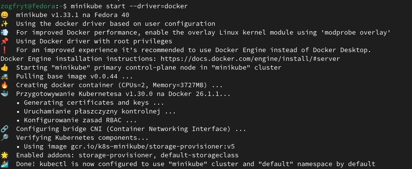

## Installing NFS-server

Using helm I have installed proposed NFS.
```
helm repo add nfs-ganesha-server-and-external-provisioner https://kubernetes-sigs.github.io/nfs-ganesha-server-add-external-provisioner/
helm install nfs-server nfs-ganesha-server-and-external-provisioner/nfs-server-provisioner --set=storageClass.name=storage-class
```

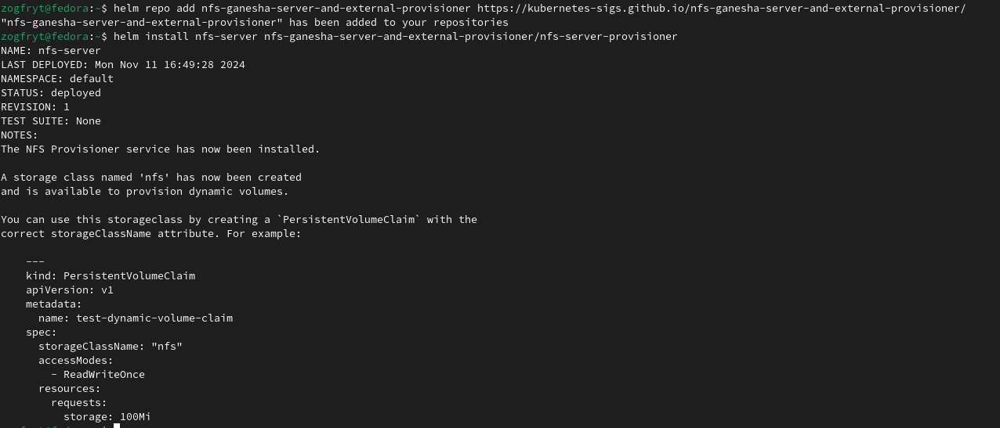
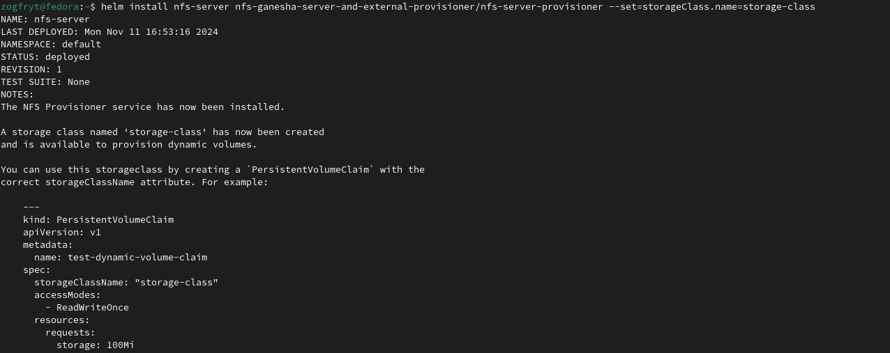

## Applying PVC

With created configuration file pvc.yaml (all commands has been run from home directory)

```
kubectl apply -f pvc.yaml
```
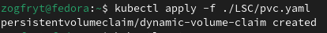

## Applying deployment

With created deployment.yaml I've provisioned containers.

```
kubectl apply -f deployment.yaml
```

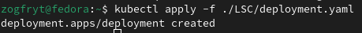

## Applying Service

With created service.yaml I've provisioned service. I've decided to create LoadBalancer for easy access to website.

```
kubectl apply -f service.yaml
```

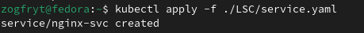

In order to access this service, i had to run tunnel in minikube.

```
minikube tunnel
```

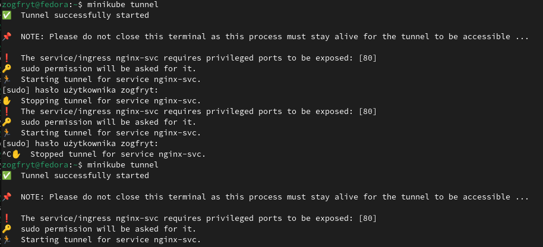

To connect i have to collect external IP address.

```
kubectl get svc
```

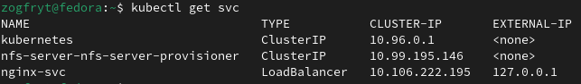

## Connecting before job

As I've connected PV to the nginx, folder containing website was empty.

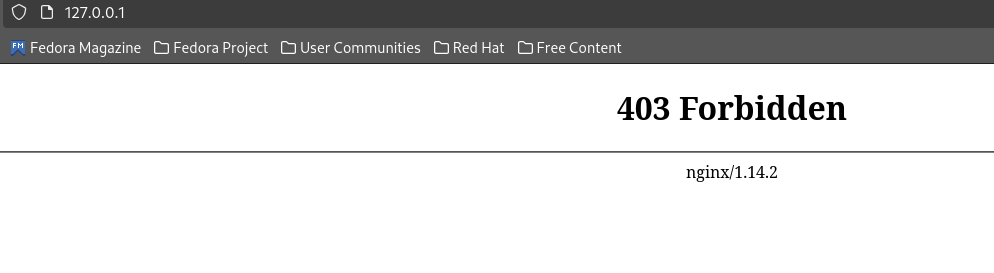

## Applying job

With created script job.yaml i'have runned job creating and coping new html into the shared PV

```
kubectl apply -f job.yaml
```

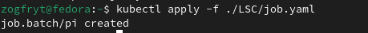

## Checking site

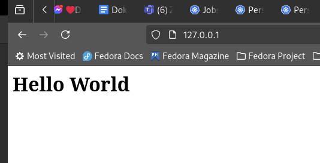